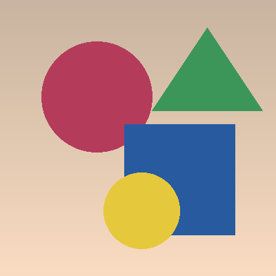
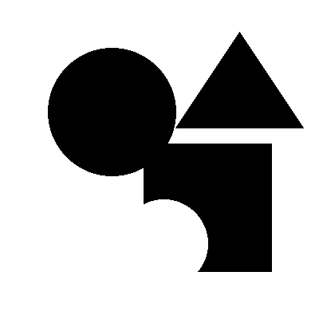
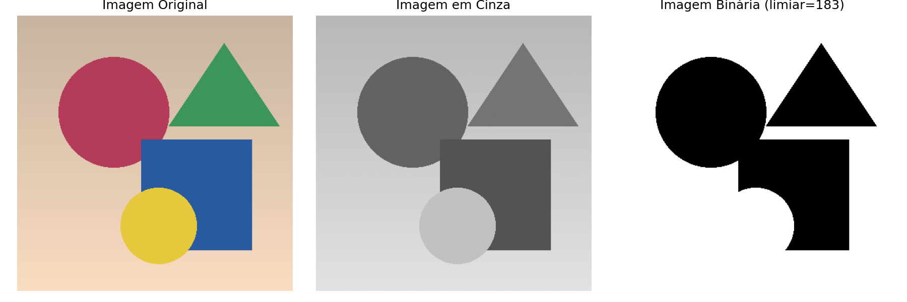
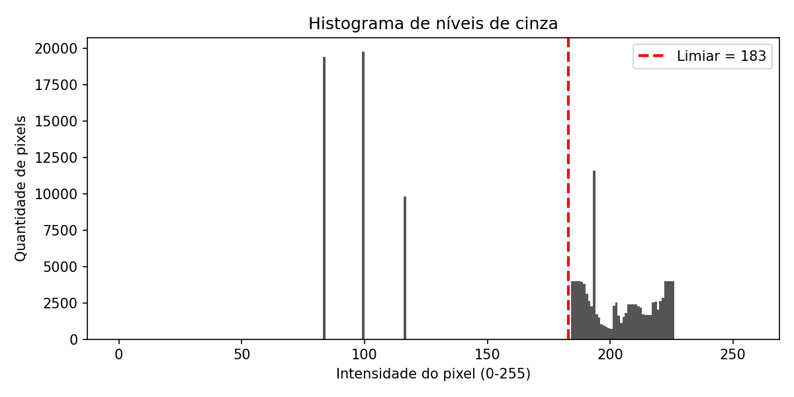

# Desafio DIO — Binarização de Imagens


Implementação em Python do algoritmo apresentado na aula, transformando uma
imagem colorida em:

1. **Níveis de cinza** (0 a 255)
2. **Imagem binarizada** (apenas 0 e 255 — preto e branco)

Além do pipeline básico pedido no desafio, o projeto foi expandido com
**cálculo automático de limiar (método de Otsu)**, **testes automatizados**,
**CI no GitHub Actions** e **visualização de histograma**.

## 📷 Resultado

| Original | Cinza | Binária (Otsu) |
|---|---|---|
|  |  |  |

**Comparativo lado a lado** (igual ao print do enunciado):



**Histograma** de níveis de cinza, com o limiar escolhido marcado em vermelho:



> Imagem de exemplo gerada proceduralmente (`imagens/entrada.png`) apenas
> para demonstração do pipeline. Substitua por qualquer imagem sua — o
> script funciona com qualquer `.png`/`.jpg`.

## 🧠 Como funciona

- **Escala de cinza:** cada pixel RGB é convertido para um único valor de
  luminância usando a fórmula ponderada `Y = 0.299R + 0.587G + 0.114B`
  (aplicada pelo Pillow no modo `"L"`).
- **Binarização por limiar fixo:** cada pixel em cinza é comparado a um
  limiar informado manualmente. Valores `>= limiar` viram branco (`255`) e
  valores `< limiar` viram preto (`0`).
- **Binarização automática (Otsu):** em vez de "chutar" um limiar, o
  algoritmo de [Otsu (1979)](https://en.wikipedia.org/wiki/Otsu%27s_method)
  testa todos os 256 valores possíveis e escolhe aquele que **maximiza a
  separação estatística** entre os pixels mais escuros (fundo) e mais claros
  (objeto), com base no histograma da imagem. Para a imagem de exemplo deste
  repositório, o limiar ótimo encontrado é `183`.

## 📂 Estrutura

```
.
├── binarizacao.py              # Pipeline principal (cinza + binária + Otsu)
├── visualizar.py                 # Gera comparativo e histograma
├── tests/
│   └── test_binarizacao.py        # Testes unitários (pytest)
├── .github/workflows/ci.yml       # CI: roda os testes em cada push/PR
├── imagens/
│   └── entrada.png                 # Imagem de exemplo
├── saida/                          # Resultados gerados (criado automaticamente)
├── requirements.txt
├── LICENSE
└── README.md
```

## ▶️ Como executar

```bash
# instalar dependências
pip install -r requirements.txt

# gerar as imagens com limiar manual (padrão 127)
python binarizacao.py imagens/entrada.png 127

# gerar as imagens com limiar automático de Otsu
python binarizacao.py imagens/entrada.png --otsu

# gerar também o comparativo lado a lado + histograma
python visualizar.py imagens/entrada.png --otsu

# ver todas as opções
python binarizacao.py --help
```

## ✅ Testes

O projeto tem cobertura de testes unitários para a conversão em cinza, a
binarização por limiar fixo e o cálculo do limiar de Otsu:

```bash
pip install pytest
python -m pytest -v
```

Os mesmos testes rodam automaticamente em **Python 3.10, 3.11 e 3.12** via
GitHub Actions a cada `push`/`pull request` (veja o badge de CI no topo).

## 🛠️ Tecnologias

- Python 3
- Pillow (manipulação de imagem)
- NumPy (operações vetorizadas sobre a matriz de pixels e histograma)
- Matplotlib (visualização comparativa e histograma)
- Pytest (testes automatizados)
- GitHub Actions (integração contínua)

## 📚 Contexto do desafio

Desafio da trilha de Visão Computacional / Processamento de Imagens da
[DIO](https://www.dio.me/), a partir do exemplo de algoritmo de binarização
apresentado em aula.
